# Food Survey

This project was created because the cafeteria at my school (which serves fresh meals including salads, desserts and fruits everyday) wanted to shift to a less meat-based diet. 
They wanted to gauge the students' reactions to the new menus and I offered to build an app to do that.

### Q: What challenges did I have to overcome, what was interesting about this project?

A: The app has to be fast and interactive to maximise student participation and retention rates. 
I implemented a results page at the end of the survey, so students would be able to see what others thought.

To inform users I also added a message popup at the beginning of the survey that can be dismissed.

I also had to make sure the more technically versed students would have a hard time voting twice (Go to [Filtering and Security](#filtering-and-security) to see why the precautions were worth it).

I store if they have already voted in LocalStorage and send the information along with the request. 
If they have already voted, their vote is silently discarded. 
CSRF was off the table sadly, as backend and frontend are not on the same server.

The voting openend at 11h50, the time the first students can go eat and closed at 13h30.

## Architecture

The app relies on a NextJS frontend (`frontend`), a NextJS admin panel (`frontend-admin`), a NodeJS backend (`backend-ts`), a python script (`stats`) and a Firestore/Postgres database.

The end-user (the student) interacts only with the frontend. On opening the page, the frontend queries today's menus from the backend. If the voting has not yet openend, it shows a loading page and informs them of the time voting opens.

The admins can access the data by opening the admin panel. There they can manually open and close the voting, modify the menus and look at the votes already cast and historic data.

Using Google's Cloud Scheduler I created a script that runs once at 11h50 and once at 13h30 to open and close the votes daily.

Once the votes has been close another python script (`stats`) downloads the newest data from the database and analyses it. It then uploads the results in condensed form to be displayed in the admin panel.

I first wrote the backend in JS but moved to TS later to allow simpler development.

### Results of running the app for a month

*There are multiple menus for the same day in the table below because the students could choose between multiple meals every day*

The menus are sorted by the average score here. The best score a student could give was 5, the worst 1.

 | name                                        |   votes |     avg score | day        |
|:--------------------------------------------|--------:|--------:|:-----------|
| Pain garni à l\'orientale                    |      20 | 4.65    | 2022-03-18 |
| Filets de poulet panés                      |      13 | 4.61538 | 2022-03-23 |
| Lasagne maison de saumon                    |      15 | 4.4     | 2022-03-15 |
| Spaghetti Bio (Emilie Romagne ou carbonara) |      11 | 4.27273 | 2022-03-25 |
| Escalope de porc viennois                   |      22 | 4.18182 | 2022-03-14 |
| "Kaiserschmarrn"                            |      11 | 4.18182 | 2022-04-25 |
| Escalope de dinde viennoise                 |      20 | 4.1     | 2022-05-10 |
| Lasagne aux légumes frais                   |      11 | 4.09091 | 2022-03-9  |
| Tafelspitz                                  |      20 | 3.95    | 2022-03-22 |
| Rôti de dinde                               |      17 | 3.94118 | 2022-03-15 |
| Escalope de poulet viennoise                |      10 | 3.9     | 2022-03-29 |
| Penne à la sauce tomate                     |      12 | 3.66667 | 2022-04-6  |
| Chili sin Carne                             |      33 | 3.57576 | 2022-03-16 |
| Cordon bleu                                 |      12 | 3.5     | 2022-04-8  |
| Coq au vin                                  |      18 | 3.44444 | 2022-05-9  |
| Topfenschmarn                               |      15 | 3.4     | 2022-05-11 |
| Kaiserschmarrn                              |      14 | 3.35714 | 2022-03-17 |
| Pilaf de viande à la viennoise              |      23 | 3.34783 | 2022-03-21 |
| Bâtonnets de mozzarella panées              |      10 | 3.3     | 2022-03-14 |
| Bol végétarien à la marocaine aux falafels  |      10 | 3.1     | 2022-05-12 |
| Gratin de poireaux                          |      10 | 2.9     | 2022-03-21 |
| Beurek au fromage et salade vert            |      10 | 2.8     | 2022-03-9  |

### Filtering and Security

To prevent students from voting twice I stored both the IP and a fingerprint of the device for each vote.

This graph shows the votes cast each day, without filtering by ip's or fingerprints.

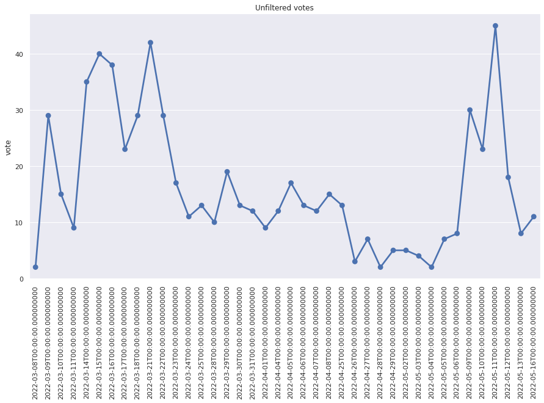

This graph shows the difference in number of votes for the different filters: (*not filtered in blue, filtered by fp in orange and filtered by ip in green*)

The vote on the `2022-05-11` was manipulated by someone who cast about 25 votes from the same device and the same ip. The other days were only sometimes and very minimally manipulated.

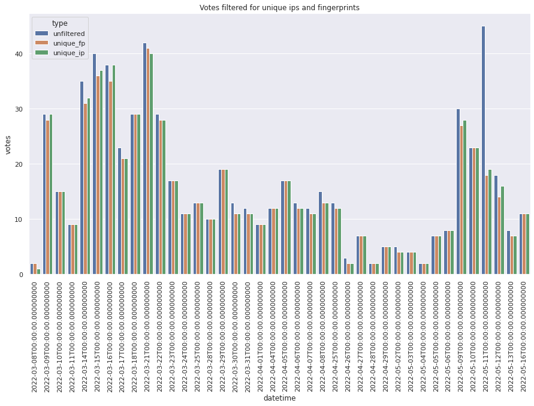

This graph shows the number of votes cast, filtered by ip. You can clearly see a difference.

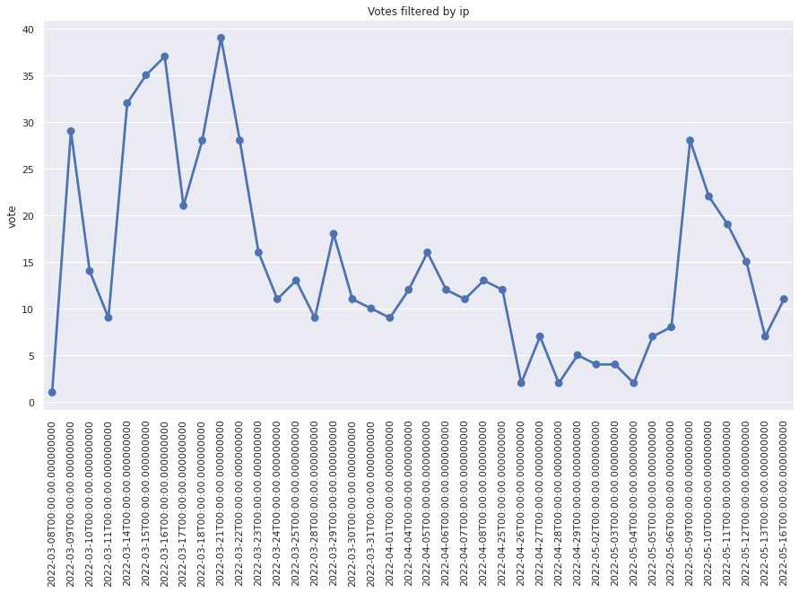

### End-User
The screen the users see when voting has not yet begun:

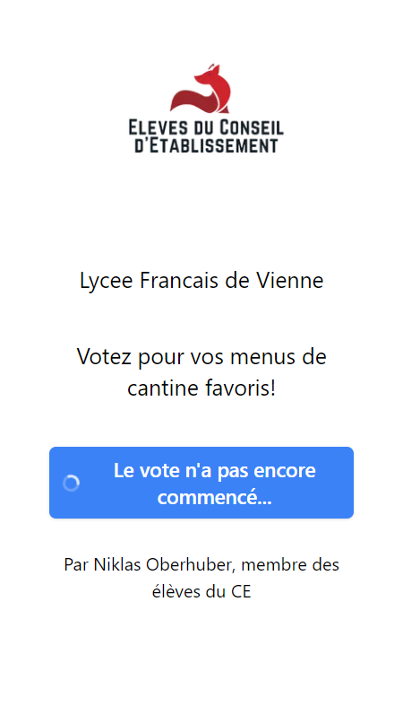

The message:

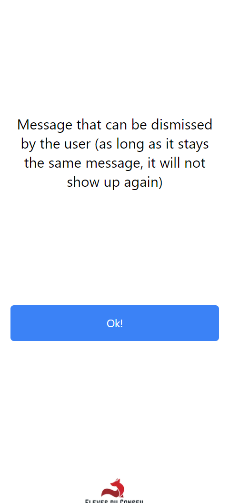

The menu choice:

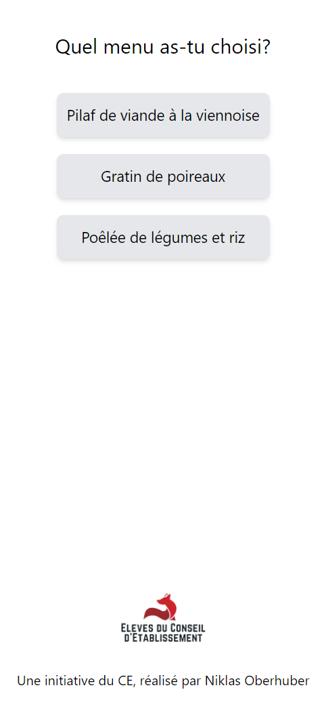

The user is prompted to score the menu:

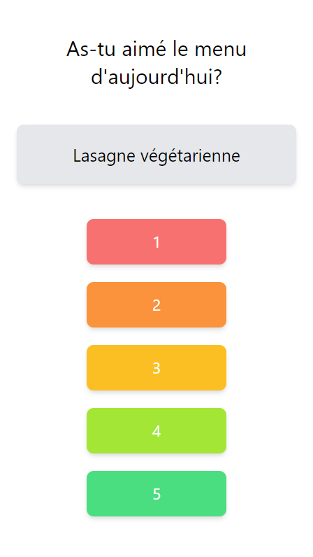

The user is asked for their class:

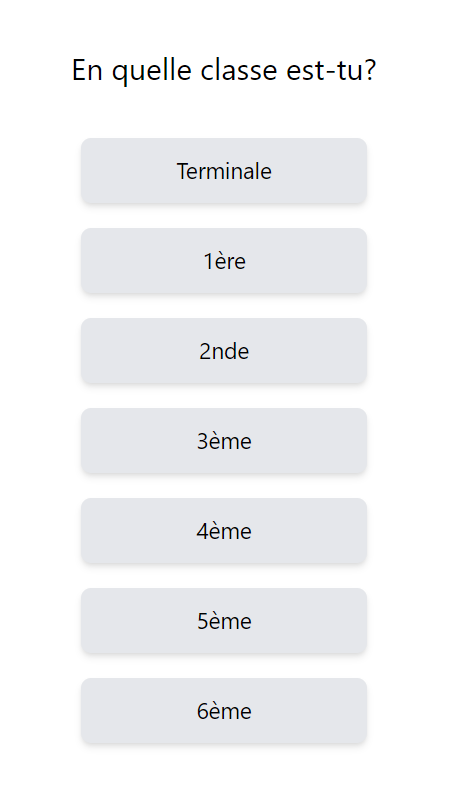

The user can now see their results and compare them:

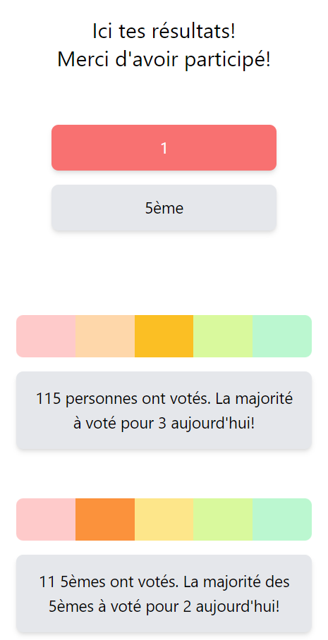

### Staff
Enter today's menu (You can add multiple menus and use the arrows on top to add menus for the next days):

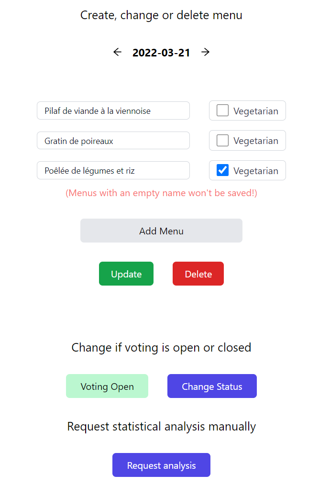

See current results:

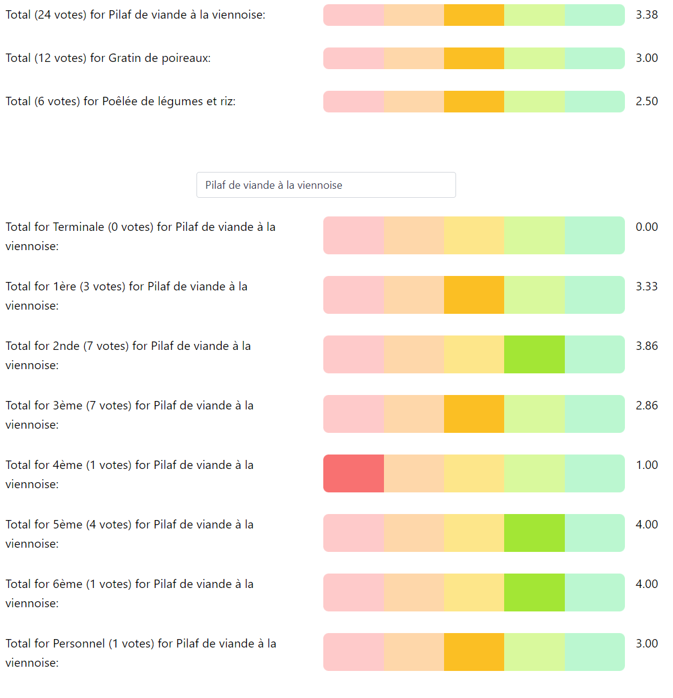

Change message:

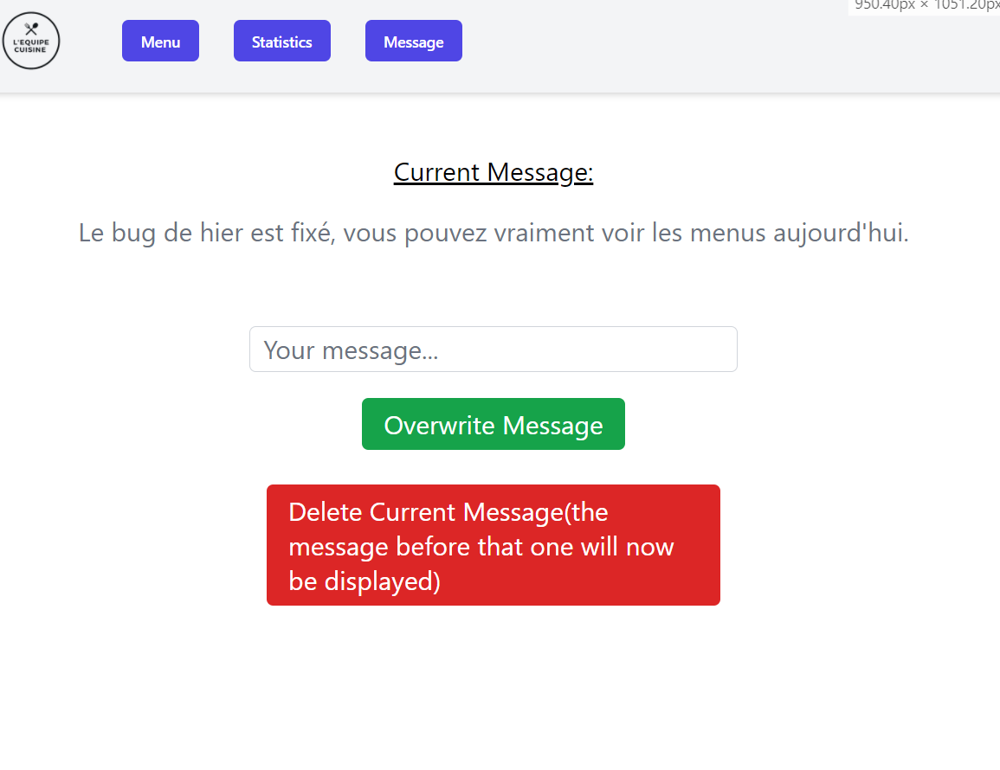

Menus are then ranked:

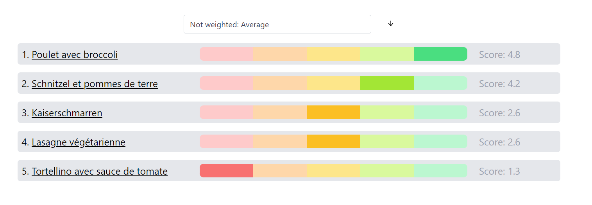

Select different ranking strategies:

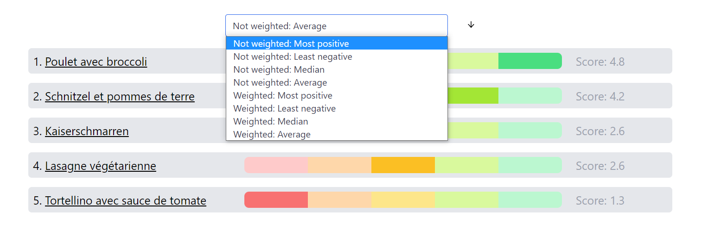

## GCP
I deployed the app on GCP:
 - the containers are all running on `Cloud Run`
 - I manage secrets and environment variables using the `Secret Manager`
 - The Database is a simple `Firestore` database running in `Native Mode`